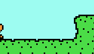

# truffleShuffle

The actor will move at a constant speed until hitting any obstacle, at which point they instantly turn around.



```json
"movement.truffleShuffle": {
    "maxSpeed": 60,
    "acceleration": 150,
    "dontTurnAnimation": true
}
```

## maxSpeed

* Type: `Number (pps)`
* Default: `40`

To what speed the actor will accelerates (and decelerates) towards its `maxSpeed`.

## acceleration

* Type: `Number (pps²)`
* Default: `200`

How fast the actor accelerates.

## startSpeed

* Type: `Number (pps²)`
* Default: `maxSpeed`

How fast the actor will move immediately after spawning.

## canStop

* Type: `Boolean`
* Default: `false`

Whether the actor should stop accelerating towards its `maxSpeed` when reaching a horizontal speed of 0, such as after being portalled, due to other components, or just `startSpeed` being 0.

## dontTurnAnimation

* Type: `Boolean`
* Default: `false`

Whether the component should _not_ turn around the actor graphically when moving to the left.
